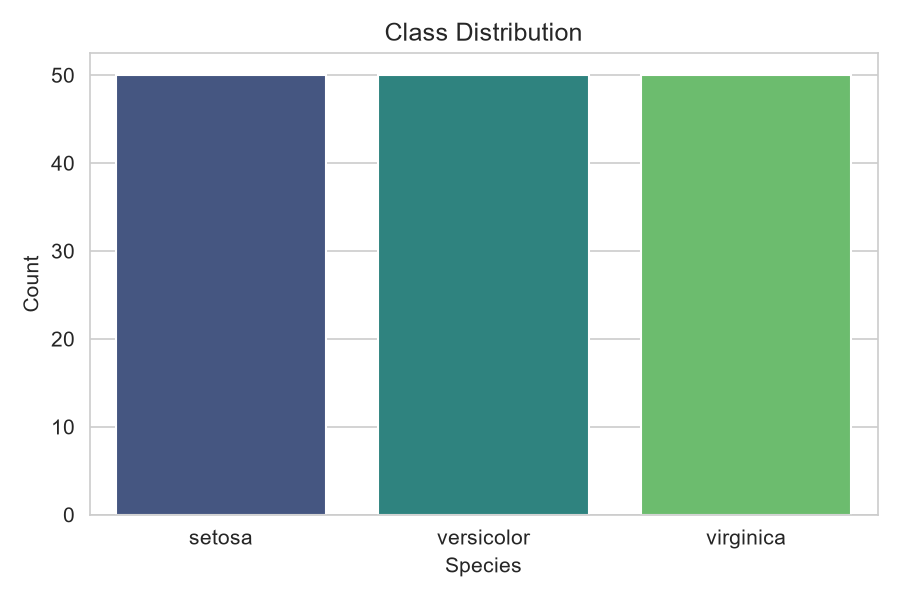
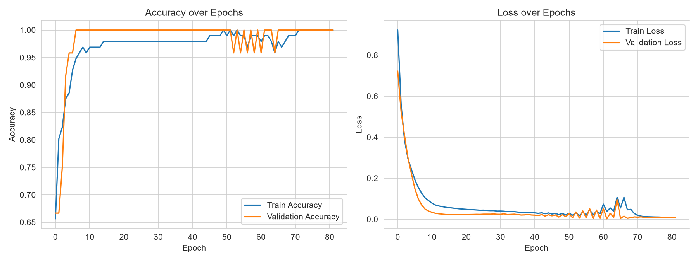
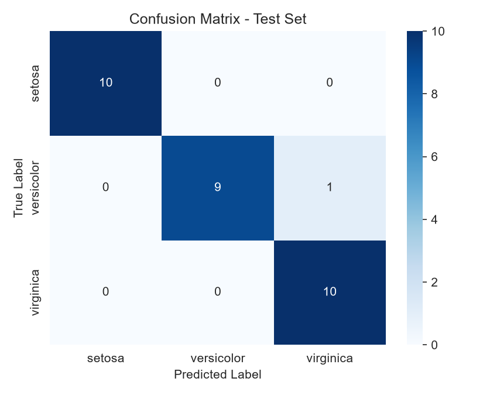

# AmulyaPoudelIrisFlowerClassification

## Student
Name: Amulya Poudel

## Project Title
**Iris Flower Classification using an Artificial Neural Network (ANN)**

## Objective
The objective of this project is to build an Artificial Neural Network (ANN)
that classifies an iris flower into one of three species — **Setosa**,
**Versicolor**, or **Virginica** — based on four numeric measurements of the
flower (sepal length, sepal width, petal length, petal width).

## Problem Statement
Setosa, Versicolor, and Virginica are closely related iris species that are
hard to tell apart by eye but differ measurably in sepal and petal size. This
project solves this as a **multi-class classification** problem: given the
four measurements of a flower, predict its species using a fully-connected
ANN built with TensorFlow/Keras.

## Dataset
- Dataset Name: Iris Dataset (Fisher, 1936)
- Source: `sklearn.datasets.load_iris` (built into scikit-learn, no external
  file needed)
- Total Samples: 150
- Features: sepal length, sepal width, petal length, petal width (cm)
- Classes: Setosa (50), Versicolor (50), Virginica (50) — perfectly balanced
- Missing values: none
- Duplicate rows: 1 (a well-known, naturally occurring duplicate in this
  dataset, kept as-is since it is a valid measurement)



**Preprocessing:**
- Checked for missing values and duplicates
- Split features (`X`) from target label (`y`)
- 80/20 stratified train-test split
- Standardized features using `StandardScaler`, fit on the training set only
  (then applied to the test set) to avoid data leakage

## ANN Architecture
A simple feedforward ANN built with TensorFlow/Keras:

| Layer | Neurons | Activation |
|---|---|---|
| Input | 4 | — |
| Hidden 1 | 16 | ReLU |
| Hidden 2 | 8 | ReLU |
| Output | 3 | Softmax |

Trained with the Adam optimizer (lr = 0.01), sparse categorical crossentropy
loss, batch size 8, up to 150 epochs with early stopping on validation loss
(patience = 20, restoring best weights).

## Results

### Model Performance
- Test Accuracy: **96.67%**
- Test Loss: **0.1286**

Training and validation accuracy climb together to a high plateau while both
loss curves fall smoothly without diverging, indicating the model
generalizes well rather than overfitting.



**Confusion Matrix:**



All 10 setosa test samples were classified correctly. One versicolor sample
was misclassified as virginica; all virginica samples were classified
correctly — consistent with the known overlap between these two species.

| Class | Precision | Recall | F1-score |
|---|---|---|---|
| Setosa | 1.00 | 1.00 | 1.00 |
| Versicolor | 1.00 | 0.90 | 0.95 |
| Virginica | 0.91 | 1.00 | 0.95 |

**Sample Predictions (new, unseen measurements):**

| Sepal Length | Sepal Width | Petal Length | Petal Width | Predicted Species |
|---|---|---|---|---|
| 5.1 | 3.5 | 1.4 | 0.2 | Setosa |
| 6.0 | 2.7 | 5.1 | 1.6 | Virginica |
| 6.7 | 3.3 | 5.7 | 2.5 | Virginica |

The first sample (small petals) is confidently classified as setosa, as
expected. The second sample falls in the region where versicolor and
virginica overlap and was assigned to virginica — a direct illustration of
the same boundary ambiguity seen in the confusion matrix.

## Conclusion
This project implemented an end-to-end ANN pipeline for iris species
classification: data loading and cleaning, stratified train/test split,
feature standardization, a 2-hidden-layer ANN, training with early stopping,
and full evaluation. The model achieves **96.67% test accuracy** with strong
precision/recall/F1 across all three classes. Setosa is classified perfectly
since it is linearly separable from the other two species; the only error
occurs at the versicolor/virginica boundary, consistent with their known
feature overlap.

**Possible improvements:** k-fold cross-validation for a more robust
performance estimate, hyperparameter tuning (layer sizes, learning rate,
dropout), and comparison against classical baselines (SVM, k-NN, logistic
regression).

## Tech Stack
- Python
- TensorFlow / Keras
- Scikit-learn
- Pandas
- NumPy
- Seaborn / Matplotlib
- Joblib

## How to Run
```bash
pip install -r requirements.txt
cd src
python main.py       # train the model, save model/scaler/plots
python predict.py    # predict species for new sample measurements
```
