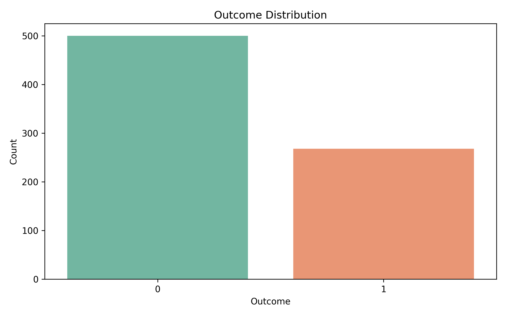
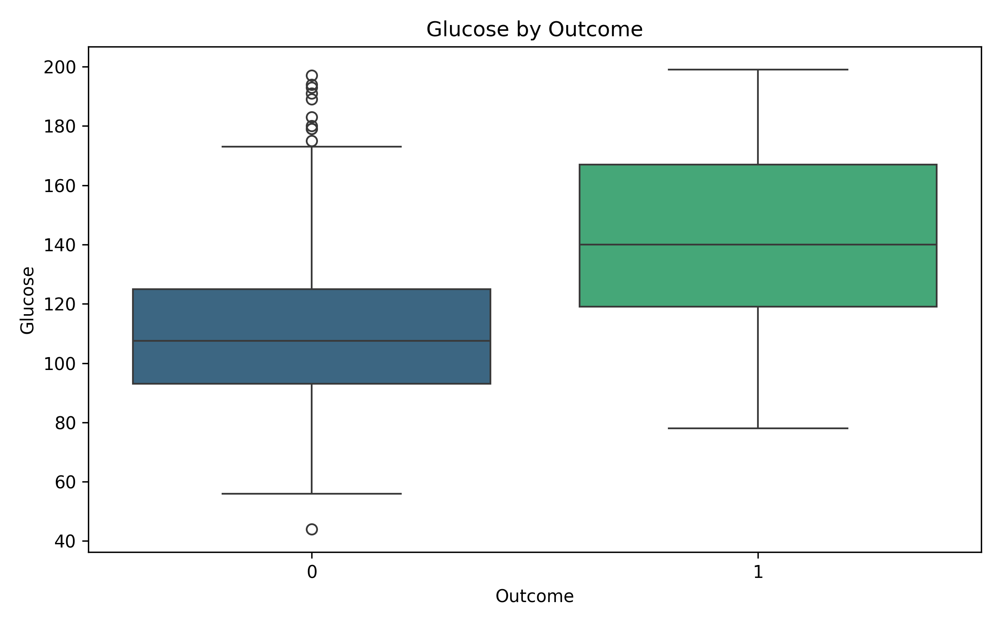
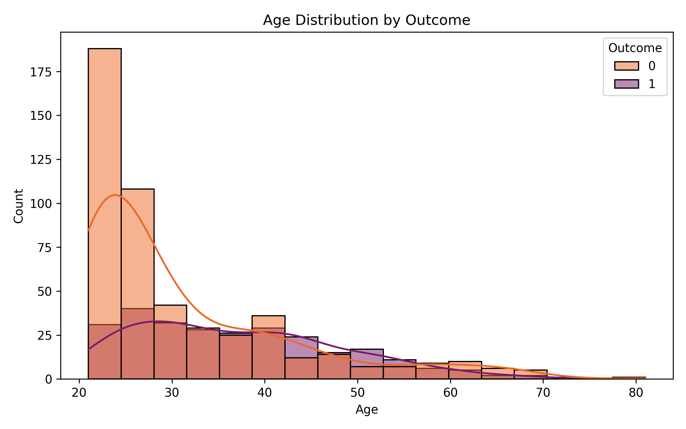
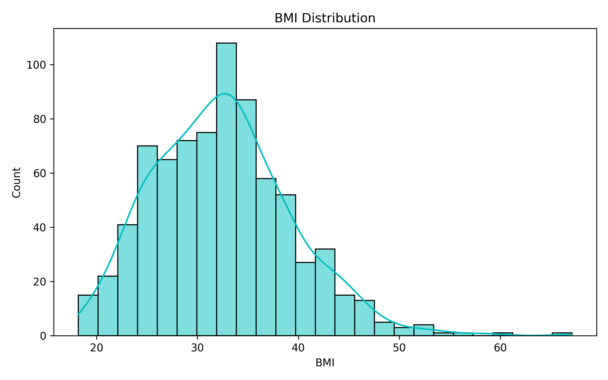
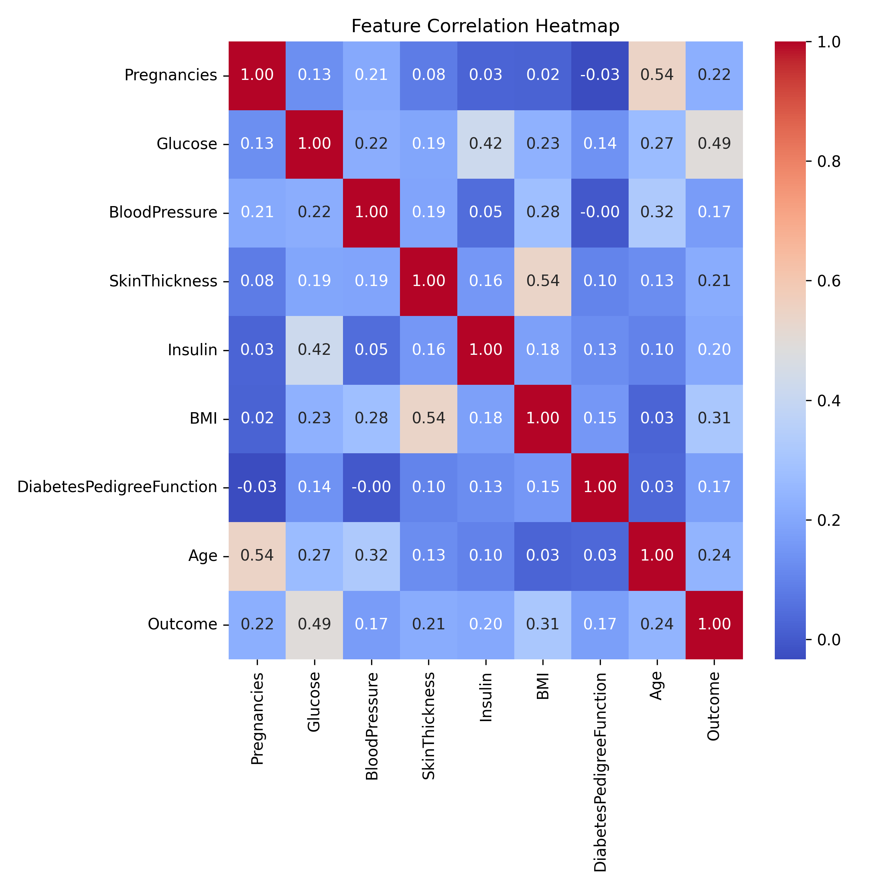
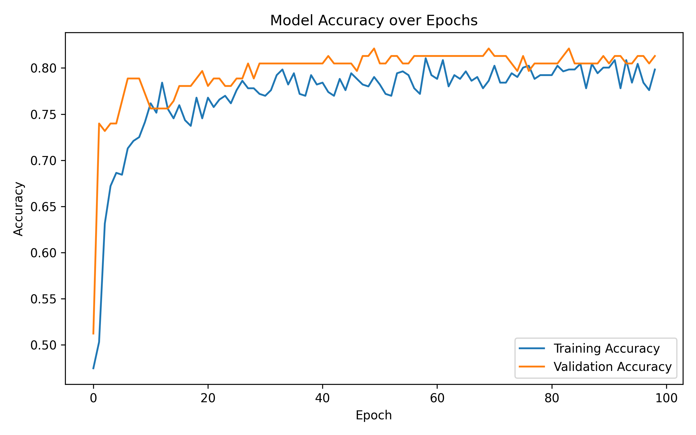
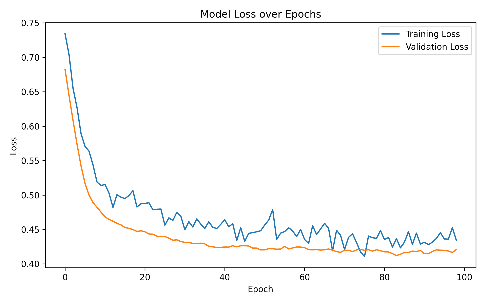
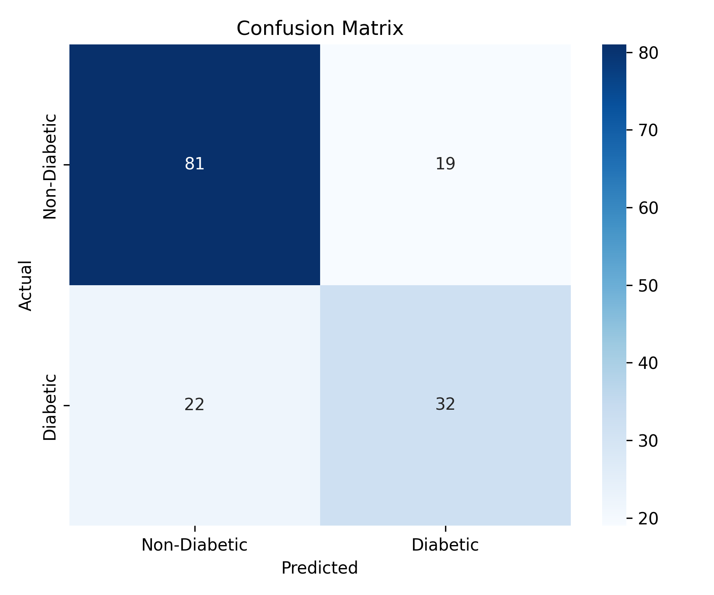

# Diabetes Prediction Report

## Model Summary

- Test Loss: 0.5027
- Test Accuracy: 0.7338
- Precision: 0.6275
- Recall: 0.5926
- F1 Score: 0.6095

## Classification Report

```text
              precision    recall  f1-score   support

           0       0.79      0.81      0.80       100
           1       0.63      0.59      0.61        54

    accuracy                           0.73       154
   macro avg       0.71      0.70      0.70       154
weighted avg       0.73      0.73      0.73       154

```

## Visualizations

















