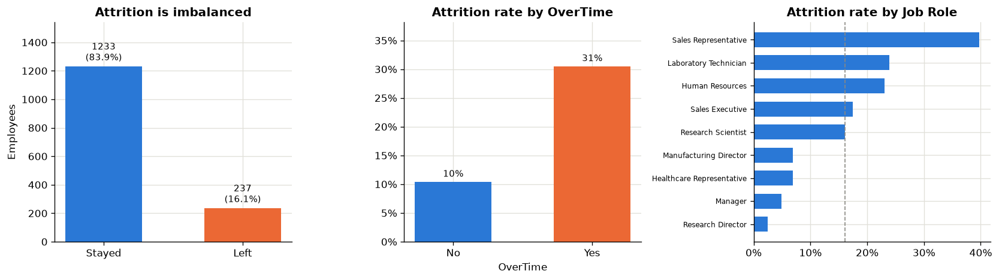
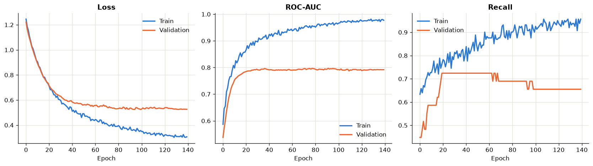
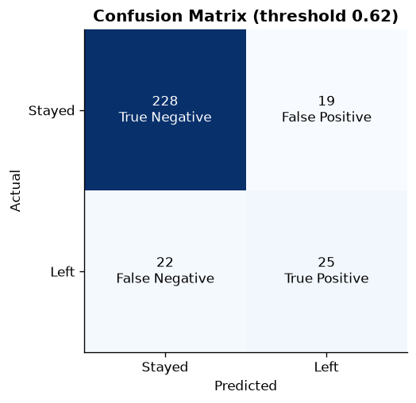
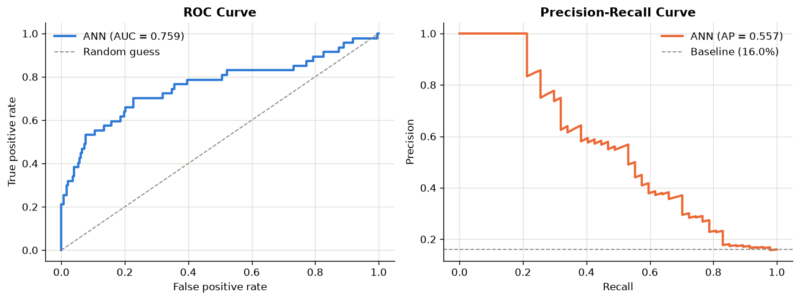
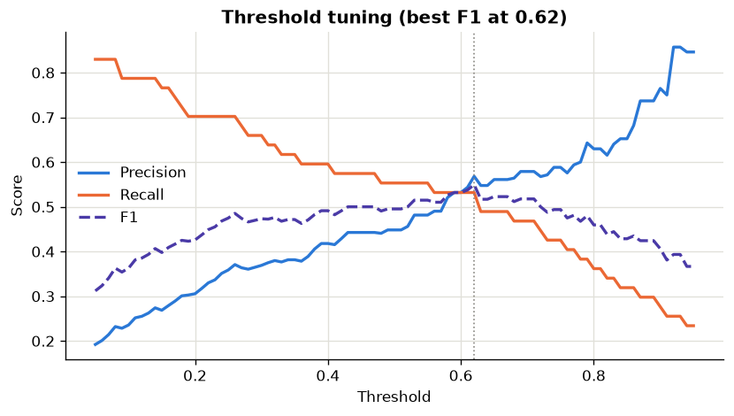

# PrajwolSapkotaEmployeeAttritionPrediction

## Student
Name: Prajwol Sapkota

## Project Title
**Employee Attrition Prediction using Artificial Neural Network (ANN)**

## Objective
The objective of this project is to build an ANN model that predicts whether an employee
will leave the company or stay, using details like age, salary, overtime, job role and
satisfaction level. This helps the HR department find out which employees are likely to
leave, so they can take action before the employee resigns.

## Problem Statement
When an employee leaves, the company has to spend time and money to hire and train a new
person. Usually HR comes to know only after the employee has already resigned.

The main problem with this dataset is that it is imbalanced. Only 16% of the employees
left. So a model that always predicts "stays" will get 84% accuracy but it will not catch
a single leaver. Because of this I checked precision and recall also, not only accuracy.

## Dataset
- Dataset Name: IBM HR Analytics Employee Attrition & Performance
- Source: Kaggle
- Total Employees: 1,470
- Total Columns: 35
- Classes:
  - Stayed (No): 1,233 (83.9%)
  - Left (Yes): 237 (16.1%)
- Missing values: 0

**Preprocessing:**
- Removed `EmployeeCount`, `Over18` and `StandardHours` because they have the same value
  for all employees. Also removed `EmployeeNumber` because it is only an ID.
- `Attrition` column changed to No = 0 and Yes = 1.
- One-hot encoding done on 7 text columns (BusinessTravel, Department, EducationField,
  Gender, JobRole, MaritalStatus, OverTime). Features increased from 30 to 44.
- Data split into train (999), validation (177) and test (294) using stratified split so
  that all three sets have the same 16% ratio.
- StandardScaler applied. It was fitted only on training data.
- Class weights used so that the "Left" class gets about 5 times more importance.

**EDA:**



- OverTime is the biggest factor. 31% of employees doing overtime left, but only 10% of
  those who did not do overtime.
- Sales Representative has the highest attrition (about 40%).
- Younger employees, low salary employees and new employees leave more.

## ANN Architecture
A feedforward ANN made using TensorFlow/Keras:

| Layer | Neurons | Activation |
|---|---|---|
| Input | 44 | - |
| Hidden 1 | 32 | ReLU |
| Dropout (0.3) | - | - |
| Hidden 2 | 16 | ReLU |
| Output | 1 | Sigmoid |

Total parameters: 1,985

Trained with Adam optimizer (learning rate 0.0005), binary crossentropy loss, batch size
32 and class weights. EarlyStopping stopped the training at 140 epochs. Dropout and L2
were used to reduce overfitting. I tried bigger networks like 128-64 and 64-32-16 also,
but they gave lower accuracy because the dataset is small.

## Results



Training and validation loss both went down together, so the model is not overfitted much.

### Model Performance
Tested on 294 employees using threshold 0.62:

- ROC-AUC: **0.759**
- Accuracy: **86.1%**
- Precision (Left): 0.568
- Recall (Left): 0.532
- F1-score (Left): 0.549

**Confusion Matrix:**

|  | Predicted Stayed | Predicted Left |
|---|---|---|
| Actual Stayed | 228 | 19 |
| Actual Left | 22 | 25 |





The ROC curve is above the diagonal line (AUC 0.759 compared to 0.5 for random guessing),
which shows the model has learned properly.

### Threshold Tuning



The output layer gives a probability, so we need a cut-off value to decide Yes or No.
Instead of using 0.5, I checked different values and 0.62 gave the best F1-score.

| Threshold | Accuracy | Precision | Recall | F1 |
|---|---|---|---|---|
| 0.50 | 0.820 | 0.448 | 0.553 | 0.495 |
| 0.62 | 0.861 | 0.568 | 0.532 | 0.549 |

**Sample Predictions:**

| Employee | Probability | Prediction |
|---|---|---|
| Age 22, salary 2200, overtime Yes, single | 99.3% | Will leave |
| Age 30, salary 5000, overtime No | 9.2% | Will stay |

## Conclusion
This project implemented an ANN for employee attrition prediction. The model
(44 - 32 - 16 - 1) got a ROC-AUC of 0.759 on the test data.

The main thing I learned is that accuracy is not a good metric for imbalanced data,
because a model saying "nobody leaves" gets 83.9% accuracy but catches zero leavers.
Class weights were important, otherwise the model was predicting "stays" for almost all
employees. I also learned that a bigger network is not always better, because the bigger
networks I tried gave worse results on this small dataset. The predictions also match the
EDA, since overtime, low salary and low satisfaction increase the risk.

**Limitations:** the dataset has only 1,470 rows and 237 leavers which is small for a
neural network, and the data is created by IBM so it is not real company data.

**Possible improvements:** k-fold cross validation, SMOTE for balancing, Keras Tuner for
hyperparameter search, and SHAP to explain the predictions.

## Tech Stack
- Python
- TensorFlow / Keras
- Scikit-learn
- Pandas
- NumPy
- Matplotlib
- Joblib

## How to Run
Note: TensorFlow does not support Python 3.14, so use Python 3.13 (or 3.11 / 3.12).

```bash
pip install -r requirements.txt
cd src
python main.py       # train the model and save the graphs
python predict.py    # predict for a new employee
```

The notebook version with full EDA is in `src/employee_attrition_ann.ipynb`.
