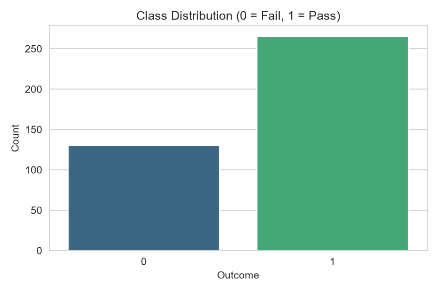
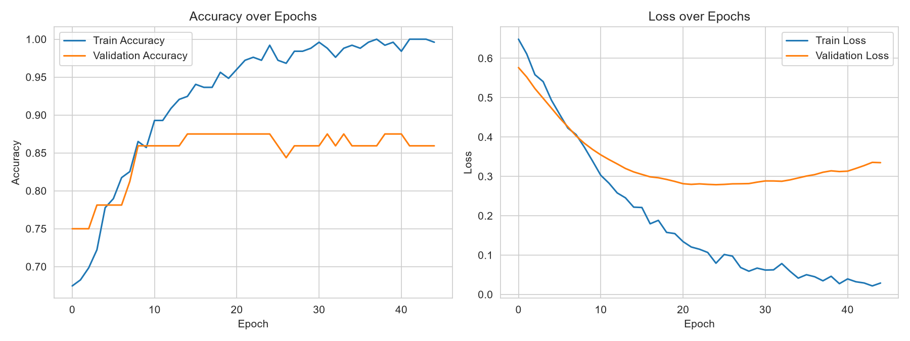
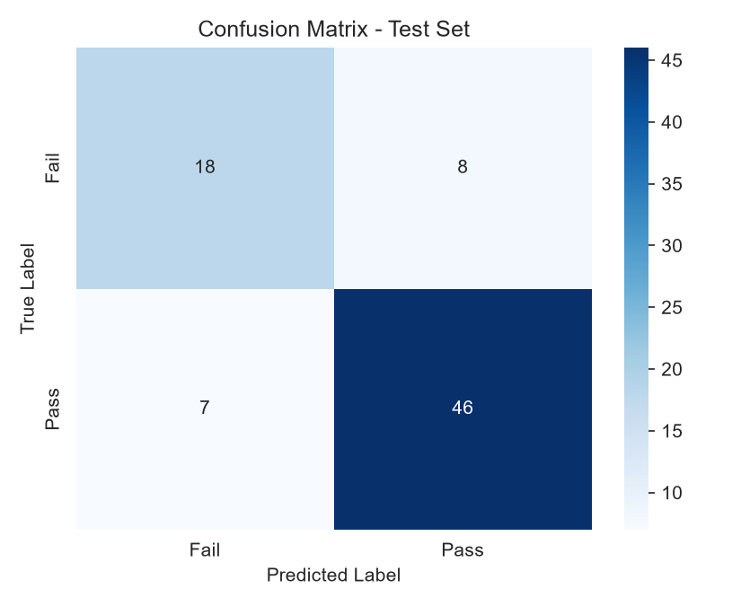

# PrasamshaThapaStudentPerformancePrediction

## Student
Name: Prashamsa Thapa

## Project Title
**Student Performance Prediction (Pass/Fail) using an Artificial Neural Network (ANN)**

## Objective
The objective of this project is to build an Artificial Neural Network (ANN)
that predicts whether a student will **Pass** or **Fail** their final exam,
based on demographic information, family background, study habits, and
earlier-term grades. Such a model could act as an early-warning system to
flag at-risk students before final exams.

## Problem Statement
Many factors beyond raw test scores — study time, past failures, parental
education, internet access, social habits, and more — influence whether a
student ultimately passes a course. This project frames the task as a
**binary classification** problem: given a student's profile and first/second
period grades, predict Pass (final grade ≥ 10/20) or Fail (final grade < 10/20)
using a fully-connected ANN built with TensorFlow/Keras.

## Dataset
- Dataset Name: UCI Student Performance Dataset (Math course)
- Source: [UCI Machine Learning Repository](https://archive.ics.uci.edu/dataset/320/student+performance)
  (`student-mat.csv`, included in `dataset/`)
- Total Samples: 395 students
- Features: 32 raw attributes — demographics (age, sex, address), family
  background (parents' education/jobs, family size), school-related
  (study time, past failures, extra support), lifestyle (free time, going
  out, alcohol consumption, health), and academic history (G1, G2 — first
  and second period grades)
- Target: `pass` — derived from `G3` (final grade), 1 if `G3 >= 10` else 0
- Class balance: 265 Pass / 130 Fail
- Missing values: none



**Preprocessing:**
- Derived the binary `pass`/`fail` target from `G3` (final grade), then
  dropped `G3` from the input features
- Encoded binary categorical columns (e.g. `sex`, `internet`, `higher`) as 0/1
- One-hot encoded multi-category columns (`Mjob`, `Fjob`, `reason`, `guardian`)
- 80/20 stratified train-test split
- Standardized all input features using `StandardScaler`, fit on the
  training set only (then applied to the test set) to avoid data leakage

## ANN Architecture
A feedforward ANN built with TensorFlow/Keras:

| Layer | Neurons | Activation |
|---|---|---|
| Input | 45 (encoded features) | — |
| Hidden 1 | 32 | ReLU |
| Dropout | — | (rate 0.2) |
| Hidden 2 | 16 | ReLU |
| Output | 1 | Sigmoid |

Trained with the Adam optimizer (lr = 0.001), binary crossentropy loss,
batch size 16, up to 150 epochs with early stopping on validation loss
(patience = 20, restoring best weights).

## Results

### Model Performance
- Test Accuracy: **81.01%**
- Test Loss: **0.4368**

Training accuracy climbs steadily above validation accuracy while validation
loss plateaus after early epochs — a mild, expected gap given the dataset's
small size (395 students); early stopping and dropout keep it from
overfitting further.



**Confusion Matrix:**



| Class | Precision | Recall | F1-score |
|---|---|---|---|
| Fail | 0.72 | 0.69 | 0.71 |
| Pass | 0.85 | 0.87 | 0.86 |

The model is noticeably better at identifying "Pass" students (higher
support and recall) than "Fail" students, reflecting the class imbalance in
the dataset (265 Pass vs. 130 Fail).

**Sample Prediction (new, unseen student record):**

A student with strong study habits and high G1/G2 grades (age 17, studytime
3, failures 0, G1 = 14, G2 = 15, `higher` = yes) was predicted **Pass** with
99.93% probability — consistent with the strong influence of prior-term
grades on the final outcome.

## Conclusion
This project implemented an end-to-end ANN pipeline for student performance
prediction: data cleaning, categorical encoding, stratified train/test
split, feature standardization, a 2-hidden-layer ANN with dropout, training
with early stopping, and full evaluation. The model achieves **81% test
accuracy**, correctly identifying most passing students and reasonably
identifying failing ones, despite the modest dataset size and class
imbalance.

**Possible improvements:** class-weighting or oversampling (e.g. SMOTE) to
address the Pass/Fail imbalance, k-fold cross-validation for a more robust
performance estimate, hyperparameter tuning, and comparing an ANN trained
without G1/G2 (a harder, purely demographic/behavioral prediction task) to
this one that includes early-term grades.

## Tech Stack
- Python
- TensorFlow / Keras
- Scikit-learn
- Pandas
- NumPy
- Seaborn / Matplotlib
- Joblib

## How to Run
```bash
pip install -r requirements.txt
cd src
python main.py       # train the model, save model/scaler/plots
python predict.py    # predict Pass/Fail for a new student record
```
