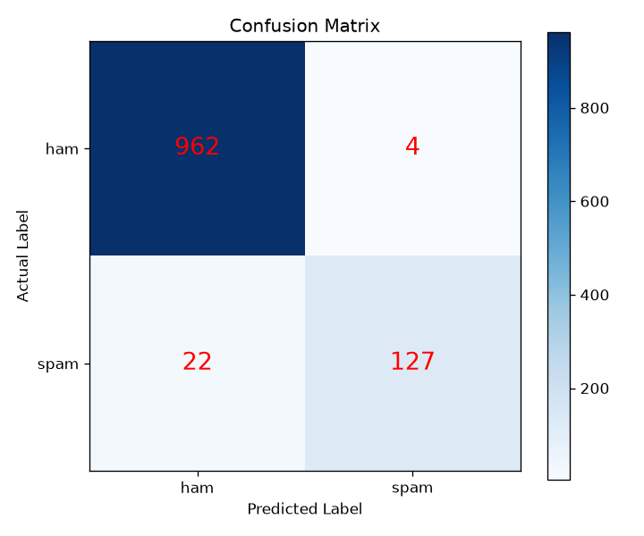
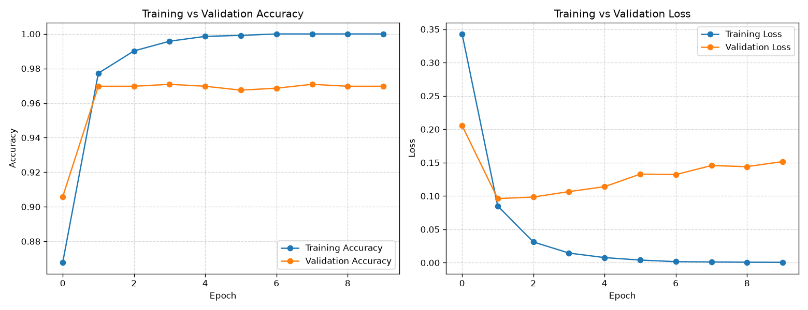

# PROJECT REPORT

# Spam Email Classification using TF-IDF and an Artificial Neural Network (ANN)

**Submitted by:** Saugat Siwakoti
**Subject:** Machine Learning
**Project Type:** Minor / Semester Project

---

## Table of Contents

1. [Title](#1-title)
2. [Abstract](#2-abstract)
3. [Introduction](#3-introduction)
4. [Objectives](#4-objectives)
5. [Dataset Description](#5-dataset-description)
6. [Text Preprocessing](#6-text-preprocessing)
7. [TF-IDF Feature Extraction](#7-tf-idf-feature-extraction)
8. [Artificial Neural Network](#8-artificial-neural-network)
9. [Training Process](#9-training-process)
10. [Evaluation Metrics](#10-evaluation-metrics)
11. [Results](#11-results)
12. [Conclusion](#12-conclusion)
13. [Future Scope](#13-future-scope)
14. [References](#14-references)

---

## 1. Title

**Spam Email Classification using TF-IDF and an Artificial Neural Network (ANN)**

---

## 2. Abstract

Spam messages are unwanted emails and text messages that are sent to a very large
number of people. They waste our time, fill up our inbox and are sometimes even
dangerous, because many of them try to steal passwords or bank details. Detecting
spam by hand is impossible because of the huge number of messages sent every day,
so an automatic system is needed.

In this project an automatic spam detection system is built using **Machine
Learning**. The text of each message is first cleaned using standard Natural
Language Processing steps (lowercasing, removal of punctuation, numbers and
stopwords, and Porter stemming). The cleaned text is then converted into numbers
using the **TF-IDF (Term Frequency – Inverse Document Frequency)** technique.
Finally, an **Artificial Neural Network** with two hidden layers is trained to
classify each message as **spam** or **ham** (not spam).

The model was trained on 4457 messages and tested on 1115 unseen messages. It
achieved an accuracy of **97.67 %**, with a precision of **0.97**, a recall of
**0.85** and an F1 score of **0.91** for the spam class. The project shows that
even a small and simple neural network, combined with good text preprocessing,
can detect spam very reliably.

---

## 3. Introduction

### 3.1 Background

Email is one of the most widely used ways of communication in the world.
Unfortunately, a very large part of all email traffic is spam — advertisements,
fake lottery announcements, phishing attempts and fraud. Reading and deleting
these messages by hand is slow and frustrating, and some of them can cause real
financial loss.

For this reason, every modern email service (Gmail, Outlook, Yahoo, ...) uses an
automatic **spam filter**. Older filters used fixed rules such as "if the subject
contains the word FREE then it is spam". The problem with fixed rules is that
spammers quickly learn how to avoid them (for example they write "FR3E" instead
of "FREE").

Machine Learning solves this problem in a much better way. Instead of writing
rules by hand, we show the computer thousands of examples of spam and ham
messages, and the computer **learns the patterns by itself**.

### 3.2 Problem Statement

Given the raw text of an email or message, automatically decide whether it is
**spam** or **ham**, without any human help.

The main difficulty is that a computer cannot read words. It can only work with
numbers. Therefore, the biggest part of the problem is converting text into
meaningful numbers — and this is exactly what TF-IDF does.

### 3.3 Scope of the Project

This project covers the complete machine learning pipeline for a text
classification problem:

- loading and exploring a real dataset,
- cleaning the text,
- converting the text into numerical features,
- splitting the data into training and testing parts,
- building, training and evaluating a neural network,
- saving the trained model and the result graphs,
- testing the model on new emails written by hand.

The project is intentionally kept simple. It is a console program written in a
single Python file so that every step can be read from top to bottom and
explained clearly.

---

## 4. Objectives

The objectives of this project are:

1. **To study the complete text classification pipeline** from raw text to a
   final prediction.
2. **To apply Natural Language Processing preprocessing techniques** such as
   tokenization, stopword removal and Porter stemming.
3. **To understand and apply TF-IDF** for converting text into numerical
   features.
4. **To design an Artificial Neural Network** with an input layer, two hidden
   layers, a dropout layer and a sigmoid output layer.
5. **To train the network** using the Adam optimizer and binary cross-entropy
   loss.
6. **To evaluate the model properly** using accuracy, confusion matrix,
   precision, recall and F1 score, and to understand why accuracy alone is not
   enough on an imbalanced dataset.
7. **To visualise the training process** with accuracy and loss graphs, and to
   recognise overfitting from those graphs.
8. **To save the trained model** so that it can be reused later.
9. **To demonstrate the model** on custom, hand written email examples.

---

## 5. Dataset Description

### 5.1 Source

The dataset used is the well known **SMS Spam Collection Dataset**, which is
freely available on the UCI Machine Learning Repository and on Kaggle. The file
is stored in this project as:

```
dataset/mail_data.csv
```

### 5.2 Structure

The CSV file has two columns. In the original file they are named `Category` and
`Message`; in our program they are renamed to the simpler names `label` and
`text`.

| Column | Description | Example |
|--------|-------------|---------|
| `label` | The class of the message: `ham` or `spam` | `spam` |
| `text` | The full text of the message | `Free entry in 2 a wkly comp to win FA Cup final tkts...` |

### 5.3 Basic Statistics

| Property | Value |
|----------|-------|
| Total number of messages | **5572** |
| Number of columns | 2 |
| Ham (genuine) messages | **4825** (86.59 %) |
| Spam messages | **747** (13.41 %) |
| Missing values | **0** |

### 5.4 Sample Rows

| label | text |
|-------|------|
| ham | Go until jurong point, crazy.. Available only in bugis n great world la e buffet... |
| ham | Ok lar... Joking wif u oni... |
| spam | Free entry in 2 a wkly comp to win FA Cup final tkts 21st May 2005... |
| ham | U dun say so early hor... U c already then say... |
| ham | Nah I don't think he goes to usf, he lives around here though |

### 5.5 Important Observation — Class Imbalance

The dataset is **imbalanced**: there are about 6.5 times more ham messages than
spam messages. This is very important to understand, because it means:

> A useless model that simply predicts "ham" for every single message would
> already be **86.59 % accurate**.

Therefore accuracy alone cannot tell us whether the model is good. We must also
look at **precision, recall and the F1 score for the spam class**, which is why
those metrics are calculated in Section 10.

To handle the imbalance during the train/test split, the parameter
`stratify=y` was used. It guarantees that the training set and the testing set
both contain the same 86.6 % / 13.4 % proportion of ham and spam.

---

## 6. Text Preprocessing

Raw text cannot be given directly to a machine learning model. It contains
capital letters, punctuation, numbers and many very common words that carry no
information. Preprocessing removes all this "noise" so that only the meaningful
words remain.

In this project, preprocessing is done inside the function `clean_text()` in
`src/main.py`. It performs seven steps, in this exact order.

### 6.1 Lowercase Conversion

```python
email_text = email_text.lower()
```

**Why:** the computer treats `"FREE"`, `"Free"` and `"free"` as three completely
different words. Converting everything to lowercase makes them one single word,
which reduces the size of the vocabulary and helps the model learn better.

### 6.2 Removing Punctuation

```python
email_text = email_text.translate(str.maketrans("", "", string.punctuation))
```

**Why:** symbols such as `. , ! ? $ %` do not help to distinguish spam from ham
in a TF-IDF model. Removing them also prevents `"win!"` and `"win"` from being
counted as two different words.

### 6.3 Removing Numbers

```python
email_text = re.sub(r"\d+", " ", email_text)
```

**Why:** the dataset contains thousands of unique numbers (phone numbers, prices,
dates, short codes). Each one would become a separate feature, but each appears
only once or twice, so they only add noise. `\d+` means "one or more digits".

### 6.4 Removing Extra Spaces

```python
email_text = re.sub(r"\s+", " ", email_text).strip()
```

**Why:** the previous steps leave behind double spaces and blank lines. This step
replaces any group of whitespace characters with one single space and removes the
spaces at the beginning and the end.

### 6.5 Tokenization

```python
word_list = nltk.word_tokenize(email_text)
```

**Why:** tokenization breaks a sentence into a list of individual words, called
*tokens*. For example `"win free money"` becomes `["win", "free", "money"]`.
We must work with individual words in order to remove stopwords and to apply
stemming.

### 6.6 Removing English Stopwords

```python
word_list = [word for word in word_list
             if word not in english_stopwords and len(word) > 1]
```

**Why:** stopwords are extremely common words such as *the, is, at, which, and,
a, to*. They appear in almost every message, both spam and ham, so they cannot
help the model tell them apart. NLTK provides a ready-made list of 198 English
stopwords. Single-character leftovers are also dropped, because they are not
useful either.

### 6.7 Porter Stemming

```python
word_list = [porter_stemmer.stem(word) for word in word_list]
```

**Why:** stemming cuts a word down to its **root form (stem)**. For example
`"winning"`, `"wins"` and `"winner"` all become `"win"`. Without stemming these
would be three separate features, each with a weaker signal. With stemming they
become one strong feature. The **Porter Stemmer** is the most classical and most
widely used stemming algorithm for English.

### 6.8 Rejoining the Words

Finally, the list of cleaned words is joined back into one string with spaces,
because the `TfidfVectorizer` from scikit-learn expects a sentence, not a list.

### 6.9 Example: Before and After

| | Text |
|-|------|
| **Original** | `Free entry in 2 a wkly comp to win FA Cup final tkts 21st May 2005. Text FA to 87121 to receive entry question(std txt rate)T&C's apply 08452810075over18's` |
| **Cleaned** | `free entri wkli comp win fa cup final tkt st may text fa receiv entri questionstd txt ratetc appli` |

Notice how the numbers, punctuation and stopwords (`in`, `a`, `to`) have
disappeared, and how `"entry"` became `"entri"` and `"wkly"` became `"wkli"`
after stemming. The message became much shorter but kept all the words that
actually indicate spam.

---

## 7. TF-IDF Feature Extraction

### 7.1 The Idea

A neural network can only work with numbers, so every message must be turned into
a list of numbers. The simplest way would be to just count how often each word
appears (this is called *Bag of Words*). But counting has a problem: a word like
`"go"` appears in very many messages, so a high count does not mean the word is
important.

**TF-IDF** fixes this problem. It gives each word a score made of two parts.

### 7.2 Term Frequency (TF)

TF measures how often a word appears **inside one message**:

```
              number of times the word appears in the message
TF(word) = ─────────────────────────────────────────────────────
                  total number of words in that message
```

If the word `"free"` appears 3 times in a 20-word message, TF = 3/20 = 0.15.

### 7.3 Inverse Document Frequency (IDF)

IDF measures how **rare** a word is across the whole dataset:

```
                    total number of messages
IDF(word) = log ( ─────────────────────────────── )
                  number of messages containing it
```

- A word that appears in almost every message (like `"go"`) gets an IDF close
  to **0** → it is treated as unimportant.
- A word that appears in only a few messages (like `"prize"`) gets a **high**
  IDF → it is treated as important.

### 7.4 The Final Score

```
TF-IDF(word) = TF(word) × IDF(word)
```

So a word gets a **high TF-IDF score** only when it appears often in *this*
message but rarely in *other* messages. These are exactly the words that identify
what a message is about — words like `"prize"`, `"winner"`, `"claim"`, `"free"`
and `"urgent"` for spam.

### 7.5 Implementation in this Project

```python
tfidf_vectorizer = TfidfVectorizer(max_features=3000)
feature_matrix = tfidf_vectorizer.fit_transform(email_data["cleaned_text"])
X = feature_matrix.toarray()
```

| Parameter / Step | Explanation |
|------------------|-------------|
| `max_features=3000` | Keeps only the 3000 most useful words. This keeps the model small and fast, which is enough for this project. |
| `fit_transform()` | *Fit* learns the vocabulary and the IDF values from the training text; *transform* converts the text into the numeric matrix. |
| `.toarray()` | TF-IDF produces a *sparse* matrix (it stores only the non-zero values to save memory). Keras needs a normal dense NumPy array. |

### 7.6 Resulting Shape

| Item | Value |
|------|-------|
| Feature matrix `X` | **(5572, 3000)** |
| Label vector `y` | **(5572,)** |
| Vocabulary size | 3000 words |

Each of the 5572 messages is now a row of 3000 numbers. Most of these numbers are
zero, because a single short message contains only a few of the 3000 vocabulary
words.

### 7.7 A Very Important Detail

When predicting a **new** email we must use `transform()` and **never**
`fit_transform()`:

```python
email_features = tfidf_vectorizer.transform([cleaned_email]).toarray()
```

**Why:** `fit_transform()` would build a brand new vocabulary from that single
email. The column positions would then no longer match the ones the model was
trained on, and the prediction would be meaningless. The vectorizer must stay
exactly as it was after training.

---

## 8. Artificial Neural Network

### 8.1 What is an ANN?

An **Artificial Neural Network** is a model loosely inspired by the human brain.
It is made of layers of small units called **neurons**. Each neuron:

1. receives numbers from the previous layer,
2. multiplies each of them by a **weight**,
3. adds them together with a **bias**,
4. passes the result through an **activation function**,
5. sends the result to the next layer.

During training the network automatically adjusts all the weights so that its
predictions become more and more correct.

### 8.2 Architecture Used

```
              Input Layer (3000 TF-IDF features)
                            │
                            ▼
              Dense(128, activation='relu')
                            │
                            ▼
                     Dropout(0.3)
                            │
                            ▼
              Dense(64, activation='relu')
                            │
                            ▼
              Dense(1, activation='sigmoid')
                            │
                            ▼
                Output: probability of spam (0 to 1)
```

### 8.3 Explanation of Each Layer

| Layer | Description |
|-------|-------------|
| **Input (3000)** | One value for every word in the TF-IDF vocabulary. |
| **Dense(128, relu)** | The first hidden layer. Every one of the 128 neurons is connected to all 3000 inputs. It learns which combinations of words indicate spam. |
| **Dropout(0.3)** | During training, 30 % of the neurons are randomly switched off in each step. This forces the network not to depend on any single neuron and reduces **overfitting**. Dropout is only active during training, not during prediction. |
| **Dense(64, relu)** | The second hidden layer. It combines the 128 patterns into 64 more compact, higher-level patterns. |
| **Dense(1, sigmoid)** | The output layer. A single neuron gives one number between 0 and 1, which is read as *"the probability that this message is spam"*. |

### 8.4 Activation Functions

**ReLU (Rectified Linear Unit)** – used in the hidden layers:

```
ReLU(x) = max(0, x)
```

It keeps positive values unchanged and turns negative values into 0. It is simple,
very fast to compute, and it allows the network to learn **non-linear** patterns.

**Sigmoid** – used in the output layer:

```
                 1
sigmoid(x) = ─────────
             1 + e^(-x)
```

It squeezes any number into the range 0 to 1, which is exactly what we need for a
probability in a two-class (binary) problem.

### 8.5 Decision Rule

```
probability >= 0.5  →  SPAM (1)
probability <  0.5  →  HAM  (0)
```

### 8.6 Model Summary

```
Model: "sequential"
┏━━━━━━━━━━━━━━━━━━━━━━━━━━━━━━━━━┳━━━━━━━━━━━━━━━━━━━━━━━━┳━━━━━━━━━━━━━━━┓
┃ Layer (type)                    ┃ Output Shape           ┃       Param # ┃
┡━━━━━━━━━━━━━━━━━━━━━━━━━━━━━━━━━╇━━━━━━━━━━━━━━━━━━━━━━━━╇━━━━━━━━━━━━━━━┩
│ dense (Dense)                   │ (None, 128)            │       384,128 │
├─────────────────────────────────┼────────────────────────┼───────────────┤
│ dropout (Dropout)               │ (None, 128)            │             0 │
├─────────────────────────────────┼────────────────────────┼───────────────┤
│ dense_1 (Dense)                 │ (None, 64)             │         8,256 │
├─────────────────────────────────┼────────────────────────┼───────────────┤
│ dense_2 (Dense)                 │ (None, 1)              │            65 │
└─────────────────────────────────┴────────────────────────┴───────────────┘
 Total trainable params: 392,449
```

**How the parameter numbers are calculated** (a common viva question):

- Layer 1: `(3000 inputs × 128 neurons) + 128 biases = 384,128`
- Dropout: it has no weights of its own, so `0`
- Layer 2: `(128 × 64) + 64 = 8,256`
- Output:  `(64 × 1) + 1 = 65`
- **Total: 392,449 trainable parameters**

---

## 9. Training Process

### 9.1 Train / Test Split

```python
X_train, X_test, y_train, y_test = train_test_split(
    X, y, test_size=0.2, random_state=42, stratify=y)
```

| Set | Number of messages | Percentage |
|-----|--------------------|------------|
| Training set | **4457** | 80 % |
| Testing set | **1115** | 20 % |

The test set is kept completely separate and is never shown to the model during
training. This is like an exam: the student studies from the textbook (training
set) and is then tested on new questions (test set). Testing on data the model
has already seen would give a falsely high score.

`random_state=42` makes the split identical every time the program runs, so the
results can be reproduced.

### 9.2 Compilation Settings

```python
model.compile(optimizer="adam",
              loss="binary_crossentropy",
              metrics=["accuracy"])
```

| Setting | Value | Reason |
|---------|-------|--------|
| **Optimizer** | `adam` | Adam (Adaptive Moment Estimation) automatically adjusts the learning rate for each weight. It is fast, reliable, and works well without any manual tuning. |
| **Loss function** | `binary_crossentropy` | This is the standard loss for problems with exactly two classes. It gives a small penalty when the predicted probability is close to the true label, and a very large penalty when the model is confidently wrong. |
| **Metric** | `accuracy` | An easy-to-read measure of how many predictions are correct. |

### 9.3 Training Parameters

```python
training_history = model.fit(X_train, y_train,
                             epochs=10,
                             batch_size=32,
                             validation_split=0.2)
```

| Parameter | Value | Meaning |
|-----------|-------|---------|
| `epochs` | 10 | The whole training set is shown to the network 10 times. |
| `batch_size` | 32 | The weights are updated after every group of 32 messages instead of after every single one. This is faster and more stable. |
| `validation_split` | 0.2 | 20 % of the training data (about 891 messages) is set aside to check the model after each epoch. This lets us see overfitting while it is happening. |

### 9.4 Training Log (actual run)

| Epoch | Training Accuracy | Training Loss | Validation Accuracy | Validation Loss |
|-------|-------------------|---------------|---------------------|-----------------|
| 1 | 0.8679 | 0.3429 | 0.9058 | 0.2056 |
| 2 | 0.9773 | 0.0851 | 0.9697 | 0.0961 |
| 3 | 0.9902 | 0.0311 | 0.9697 | 0.0984 |
| 4 | 0.9958 | 0.0145 | 0.9709 | 0.1066 |
| 5 | 0.9986 | 0.0077 | 0.9697 | 0.1139 |
| 6 | 0.9992 | 0.0039 | 0.9675 | 0.1328 |
| 7 | 1.0000 | 0.0016 | 0.9686 | 0.1321 |
| 8 | 1.0000 | 0.0011 | 0.9709 | 0.1456 |
| 9 | 1.0000 | 0.0007 | 0.9697 | 0.1440 |
| 10 | 1.0000 | 0.0006 | 0.9697 | 0.1516 |

*(Values are rounded; the exact numbers are printed when `main.py` runs.)*

### 9.5 Reading the Training Log

Two things are clearly visible and are worth explaining in the viva:

1. **The model learns very quickly.** After only 2 epochs the validation accuracy
   is already close to 97 %. TF-IDF features are very informative, so the problem is
   not difficult for the network.

2. **Mild overfitting starts after about epoch 3.** The training loss keeps
   falling towards zero (0.0005) while the **validation loss starts rising again**
   (0.096 → 0.152). This means the network is beginning to memorise the training
   messages instead of learning general rules. The validation *accuracy* does not
   get worse, so the effect is small and the final model is still good — but it is
   the reason why training for many more epochs would not help.

This overfitting is exactly what the `Dropout(0.3)` layer is there to limit. Two
easy ways to reduce it further are discussed in the Future Scope section.

---

## 10. Evaluation Metrics

Because the dataset is imbalanced, several different metrics are used.

### 10.1 Confusion Matrix

The confusion matrix shows the four possible outcomes of a two-class prediction:

|  | Predicted Ham | Predicted Spam |
|--|---------------|----------------|
| **Actual Ham** | True Negative (TN) | False Positive (FP) |
| **Actual Spam** | False Negative (FN) | True Positive (TP) |

- **TN** – a genuine message correctly kept in the inbox. ✔
- **TP** – a spam message correctly sent to the spam folder. ✔
- **FP** – a genuine message wrongly marked as spam. ✘ **This is the worst kind
  of mistake**, because the user may miss an important email.
- **FN** – a spam message that slipped into the inbox. ✘ Annoying, but not
  dangerous — the user can simply delete it.

### 10.2 Accuracy

```
             TP + TN
Accuracy = ─────────────────
           TP + TN + FP + FN
```

The fraction of all predictions that were correct. Easy to understand, but
misleading on an imbalanced dataset (see Section 5.5).

### 10.3 Precision

```
             TP
Precision = ───────
            TP + FP
```

*"Out of all the messages we marked as spam, how many really were spam?"*

High precision means very few genuine emails end up in the spam folder.

### 10.4 Recall (Sensitivity)

```
          TP
Recall = ───────
         TP + FN
```

*"Out of all the real spam messages, how many did we actually catch?"*

High recall means very little spam reaches the inbox.

### 10.5 F1 Score

```
            Precision × Recall
F1 = 2 × ───────────────────────
            Precision + Recall
```

Precision and recall usually pull against each other: making the filter stricter
raises recall but lowers precision. The F1 score is the *harmonic mean* of the
two, so it gives one single balanced number. It is only high when **both**
precision and recall are high.

---

## 11. Results

All the results below come from an actual run of `src/main.py` and are also saved
in `results/classification_report.txt`.

### 11.1 Overall Performance

| Metric | Value |
|--------|-------|
| **Test Accuracy** | **97.67 %** |
| Precision (spam) | 0.9695 |
| Recall (spam) | 0.8523 |
| F1 Score (spam) | 0.9071 |

### 11.2 Confusion Matrix

|  | Predicted Ham | Predicted Spam |
|--|---------------|----------------|
| **Actual Ham** | **962** (TN) | **4** (FP) |
| **Actual Spam** | **22** (FN) | **127** (TP) |



### 11.3 Classification Report

```
              precision    recall  f1-score   support

         ham       0.98      1.00      0.99       966
        spam       0.97      0.85      0.91       149

    accuracy                           0.98      1115
   macro avg       0.97      0.92      0.95      1115
weighted avg       0.98      0.98      0.98      1115
```

### 11.4 Accuracy and Loss Graphs



**Left graph (accuracy):** the training accuracy rises to 100 %, while the
validation accuracy settles at about 97 %. The gap between the two lines is the
visible sign of mild overfitting.

**Right graph (loss):** the training loss falls almost to zero. The validation
loss falls until about epoch 3 and then slowly rises again — the classic shape
that shows where the model stops generalising and starts memorising.

### 11.5 Discussion of the Results

Out of 1115 unseen test messages, the model classified **1089 correctly** and
made only **26 mistakes**.

**The good news — only 4 false positives.** Out of 966 genuine messages, just 4
were wrongly marked as spam. This gives a spam precision of **0.97**. Since a lost
genuine email is the most harmful mistake a spam filter can make, this is the most
important result of the project.

**The weaker point — 22 false negatives.** Out of 149 real spam messages, 22 were
not caught, giving a recall of **0.85**. So roughly 15 out of every 100 spam
messages would still reach the inbox. The main reason is the class imbalance: the
model saw about 6.5 times more ham than spam during training, so it is naturally
biased towards predicting "ham" when it is unsure. This is an honest limitation of
the project and it is addressed in the Future Scope.

**Compared to the baseline.** A model that always predicts "ham" would score
86.59 % accuracy but would have a recall of 0. Our model reaches 97.67 % accuracy
*and* catches 85 % of spam, so it has clearly learned something real and useful.

### 11.6 Predictions on Custom Emails

Seven emails were written by hand and given to the trained model:

| # | Email | Spam Probability | Prediction | Correct? |
|---|-------|------------------|------------|----------|
| 1 | Congratulations! You have WON a FREE iPhone 15. Click this link now to claim your prize! | 1.0000 | **Spam** | ✔ |
| 2 | Hi Saugat, please find attached the notes for tomorrow's machine learning class. | 0.0006 | Ham | ✔ |
| 3 | URGENT! Your account has been suspended. Send your password and bank details immediately. | 0.9831 | **Spam** | ✔ |
| 4 | Can we reschedule our project meeting to Friday at 3 pm? Let me know if that works. | 0.0000 | Ham | ✔ |
| 5 | WINNER!! You have been selected to receive a cash prize of $50000. Reply YES to claim. | 1.0000 | **Spam** | ✔ |
| 6 | Dear sir, I have submitted the assignment on the college portal. Kindly check it. | 0.0000 | Ham | ✔ |
| 7 | FREE entry in our weekly competition to win an iPad. Text the word WIN to 80086 now! | 0.8434 | **Spam** | ✔ |

**All seven emails were classified correctly.** The model is also very *confident*:
the spam messages received probabilities above 0.84 and the genuine messages
received probabilities below 0.001.

### 11.7 A Note on Reproducibility

Two settings at the top of `main.py` make this project fully reproducible:

1. `keras.utils.set_random_seed(42)` fixes the random number generators, so the
   train/test split and the starting weights are identical in every run.
2. `tf.config.experimental.enable_op_determinism()` forces TensorFlow to add up
   the floating-point numbers in the same order every time.

The seeds alone are **not** enough. With only step 1, the accuracy still moved
between 97.67 % and 97.85 % across repeated runs, because the CPU splits the work
over several cores and the order in which the partial results are combined can
change. Adding step 2 removed that variation completely — the program was run
three times and produced byte-identical metrics each time. Every number in this
report can therefore be reproduced exactly by re-running `main.py`.

### 11.8 Generated Files

| File | Description |
|------|-------------|
| `model/spam_classifier.keras` | The trained ANN, ready to be loaded again |
| `results/accuracy_loss_graph.png` | Training vs validation accuracy and loss |
| `results/confusion_matrix.png` | Confusion matrix as a coloured picture |
| `results/classification_report.txt` | All evaluation numbers in text form |

---

## 12. Conclusion

In this project a complete spam email classification system was successfully built
using TF-IDF feature extraction and an Artificial Neural Network.

The main conclusions are:

1. **The system works well.** It reached **97.67 % accuracy** on 1115 unseen
   messages, with an F1 score of 0.91 for the spam class.

2. **Preprocessing matters a lot.** Lowercasing, removing punctuation, numbers and
   stopwords, and applying Porter stemming reduced the vocabulary dramatically and
   made the remaining features much stronger. Without these steps the model would
   have to learn from a lot of meaningless noise.

3. **TF-IDF is a simple but powerful idea.** By multiplying term frequency with
   inverse document frequency, common words are automatically pushed down and
   rare, meaningful words such as *prize*, *winner* and *claim* are pushed up.

4. **A small neural network is enough.** With only two hidden layers and about
   392,000 parameters, the model trains in under a minute on an ordinary laptop.
   Very large or complex models are not always necessary.

5. **Accuracy alone is not enough.** On this imbalanced dataset, a model that
   always answered "ham" would already be 86.59 % accurate. The confusion matrix,
   precision, recall and F1 score are what really show whether the model works.

6. **Overfitting is visible and controllable.** The rising validation loss after
   epoch 3 clearly shows the model starting to memorise the training data. The
   Dropout layer keeps this under control.

The project achieved all the objectives listed in Section 4 and gave practical
experience of the full machine learning workflow, from raw text to a saved,
working model.

---

## 13. Future Scope

The project can be extended in several ways:

1. **Fix the class imbalance to improve recall.** The model currently misses 13 %
   of spam. Using the `class_weight` parameter in `model.fit()` (so that spam
   mistakes are penalised more heavily), or oversampling the spam class, should
   raise recall noticeably.

2. **Use early stopping.** Keras `EarlyStopping` would automatically stop training
   at around epoch 3, exactly when the validation loss is at its minimum, and would
   prevent the overfitting seen in Section 9.5.

3. **Try word embeddings instead of TF-IDF.** TF-IDF does not understand meaning:
   for it, *"money"* and *"cash"* are completely unrelated. Word embeddings such as
   Word2Vec or GloVe capture meaning and similarity between words.

4. **Use sequence models.** TF-IDF ignores word order entirely. LSTM, GRU or
   Transformer models (such as BERT) read the words in order and would understand
   the difference between *"I will call the bank"* and *"the bank will call you"*.

5. **Compare with classical algorithms.** Training Naive Bayes, Logistic Regression
   and SVM on the same TF-IDF features would give an interesting comparison table
   (Naive Bayes in particular is famously strong on spam detection).

6. **Add more features.** Real spam filters also look at the number of capital
   letters, the number of exclamation marks, the presence of links, and the sender
   address. These extra features could be combined with the TF-IDF features.

7. **Build a simple user interface.** A small web page or desktop window where the
   user pastes an email and immediately sees the Spam / Ham result would make the
   project easier to demonstrate.

8. **Train on real email data.** This dataset consists of short SMS messages.
   Training on a real email corpus such as Enron-Spam would make the model useful
   for longer emails with subject lines and attachments.

---

## 14. References

1. Almeida, T. A., Gómez Hidalgo, J. M., & Yamakami, A. (2011). *Contributions to
   the Study of SMS Spam Filtering: New Collection and Results.* Proceedings of
   the ACM Symposium on Document Engineering (DocEng'11).

2. UCI Machine Learning Repository – *SMS Spam Collection Data Set*.
   https://archive.ics.uci.edu/dataset/228/sms+spam+collection

3. Scikit-learn Documentation – *TfidfVectorizer*.
   https://scikit-learn.org/stable/modules/generated/sklearn.feature_extraction.text.TfidfVectorizer.html

4. Scikit-learn Documentation – *Metrics and scoring*.
   https://scikit-learn.org/stable/modules/model_evaluation.html

5. TensorFlow / Keras Documentation – *The Sequential model*.
   https://www.tensorflow.org/guide/keras/sequential_model

6. NLTK Documentation – *Natural Language Toolkit*.
   https://www.nltk.org/

7. Porter, M. F. (1980). *An Algorithm for Suffix Stripping.* Program, 14(3),
   130–137.

8. Srivastava, N., Hinton, G., Krizhevsky, A., Sutskever, I., & Salakhutdinov, R.
   (2014). *Dropout: A Simple Way to Prevent Neural Networks from Overfitting.*
   Journal of Machine Learning Research, 15(1), 1929–1958.

9. Kingma, D. P., & Ba, J. (2015). *Adam: A Method for Stochastic Optimization.*
   International Conference on Learning Representations (ICLR).

10. Jurafsky, D., & Martin, J. H. (2023). *Speech and Language Processing*
    (3rd ed. draft). Chapter 4 – Naive Bayes and Sentiment Classification.

---

**— End of Report —**
