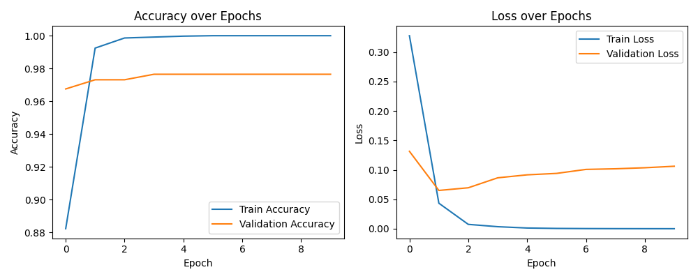
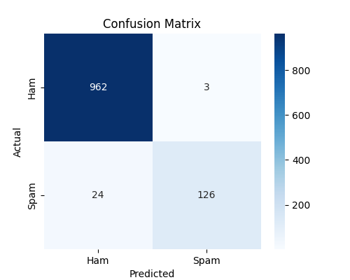

# SikhaThapaMaskiSMSSpamDetectionUsingANN

## Student
Name: Sikha Thapa Maski

## Project Title
**SMS Spam Detection using Artificial Neural Network (ANN)**

## Objective
The objective of this project is to develop an Artificial Neural Network (ANN) model capable of automatically classifying SMS messages as either **Spam** or **Ham (Not Spam)**. The system helps identify unwanted promotional or fraudulent messages while allowing legitimate messages to pass through, improving communication security and user experience.

## Problem Statement
SMS spam messages are a common nuisance and security risk, often containing scams, phishing links, or unwanted ads. This project aims to automatically classify SMS messages as Spam or Ham using a machine learning model, reducing manual effort and improving message safety.

## Dataset
- Dataset Name: SMS Spam Collection Dataset
- Source: Kaggle
- Total Messages: 5,572
- Classes:
  - Ham: 4,825
  - Spam: 747

**Preprocessing:**
- Cleaned and kept only label + message columns
- Labels mapped to Ham = 0, Spam = 1
- Text converted to numerical features using TF-IDF (with stop-word removal)
- 80/20 train-test split
- No additional feature scaling was needed, since TF-IDF already produces normalized values

## ANN Architecture
A simple feedforward ANN built with TensorFlow/Keras:

| Layer | Neurons | Activation |
|---|---|---|
| Input | 128 | ReLU |
| Hidden | 64 | ReLU |
| Output | 1 | Sigmoid |

Trained with Adam optimizer, binary crossentropy loss, 10 epochs, batch size 32.

## Results
The ANN model achieved excellent classification performance.

### Model Performance
- Training Accuracy: ~100%
- Validation Accuracy: ~97.8%
- Test Accuracy: **97.58%**



Training loss steadily decreased toward zero, while validation loss slightly increased after epoch 2 — a mild sign of overfitting, though overall performance remained strong.

**Confusion Matrix:**

|  | Predicted Ham | Predicted Spam |
|---|---|---|
| Actual Ham | 962 | 3 |
| Actual Spam | 24 | 126 |



| Class | Precision | Recall | F1-score |
|---|---|---|---|
| Ham | 0.98 | 1.00 | 0.99 |
| Spam | 0.98 | 0.84 | 0.90 |

**Sample Prediction:**

Input: "Congratulations! You have won a free iPhone. Click here to claim."
Prediction: Spam (0.98)

Input: "Hi, are we still meeting at 6 pm?"
Prediction: Ham (0.02)

## Conclusion
This project successfully implemented an **Artificial Neural Network (ANN)** for SMS spam detection. The model effectively distinguishes between spam and legitimate messages with a test accuracy of approximately **97.58%**.

The combination of **TF-IDF Vectorization** and a simple feedforward neural network produced accurate and reliable results while maintaining a straightforward architecture. The trained model can also classify new SMS messages using the saved ANN model and vectorizer.

**Possible improvements:** larger dataset, dropout layers, early stopping, class balancing, or trying LSTM/BERT for better recall.

## Tech Stack
- Python
- TensorFlow / Keras
- Scikit-learn
- Pandas
- NumPy
- Joblib

## How to Run
```bash
pip install -r requirements.txt
cd src
python main.py       # train the model
python predict.py    # test on a new message
```